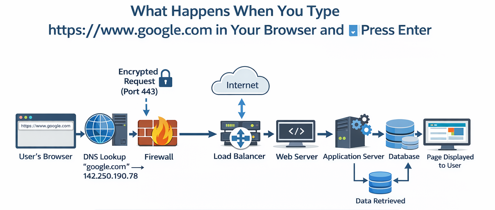

# What Happens When You Type `https://www.google.com` in Your Browser

When you type `https://www.google.com` in your browser and press Enter, a lot happens behind the scenes. This README explains the journey of your request from your computer to Google's servers and back.

---

## Flow Diagram

---

## Step-by-Step Explanation

### 1. Browser and URL Parsing
- You enter `https://www.google.com` in the browser.
- Browser parses the URL to understand the protocol (HTTPS), host (`google.com`), and path.
- Browser checks local cache for DNS and HTTP data.

### 2. DNS Resolution
- Browser queries the DNS server to convert `google.com` to an IP address (e.g., `142.250.190.78`).
- DNS may involve multiple servers until the IP is resolved.

### 3. Firewall
- The outgoing request passes through your local firewall and the server firewall for security.

### 4. Traffic to Server (TCP & TLS)
- Request is sent to the server IP on **port 443** (HTTPS).
- TLS handshake encrypts the traffic ensuring secure communication.

### 5. Load Balancer
- The request hits a **load balancer** that distributes traffic across multiple web servers for efficiency and reliability.

### 6. Web Server
- Web server receives the request and forwards it to the application server if dynamic content is needed.

### 7. Application Server
- Generates dynamic content for the page.
- Requests data from the **database** if needed.

### 8. Database
- Database processes queries and sends data back to the application server.

### 9. Back to Browser
- Application server sends the final HTML page to the web server.
- Web server returns the page to the browser via encrypted HTTPS.
- Browser renders the page for the user.

---

## Summary
1. Browser parses URL → checks cache  
2. DNS resolves domain → finds IP  
3. Firewall → ensures security  
4. TCP/TLS connection → secure communication  
5. Load balancer → distributes requests  
6. Web server → handles request  
7. Application server → generates content  
8. Database → provides data  
9. Browser renders page → visible to user

---

This explanation and diagram highlight the complexity of what seems like a simple action: typing a URL. Understanding this flow is crucial for any full-stack engineer.

